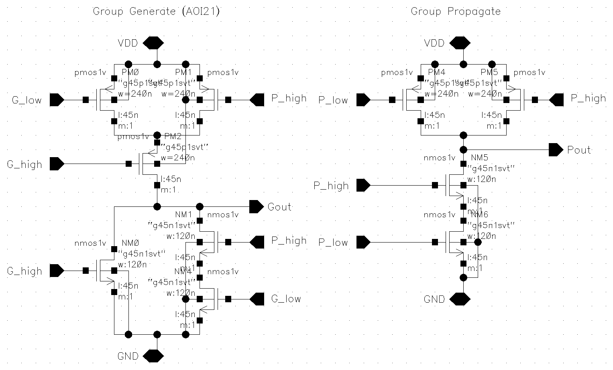
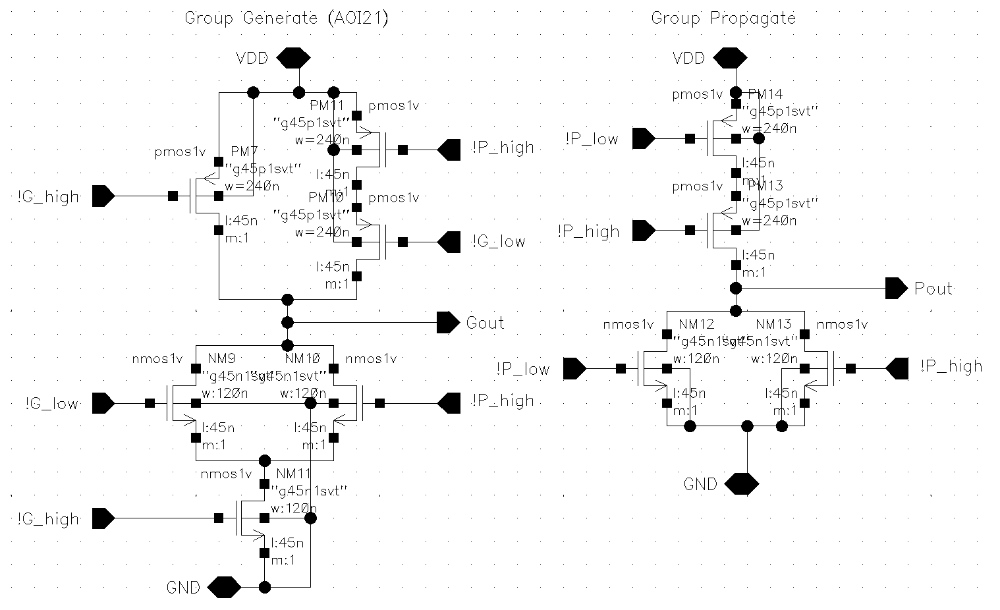
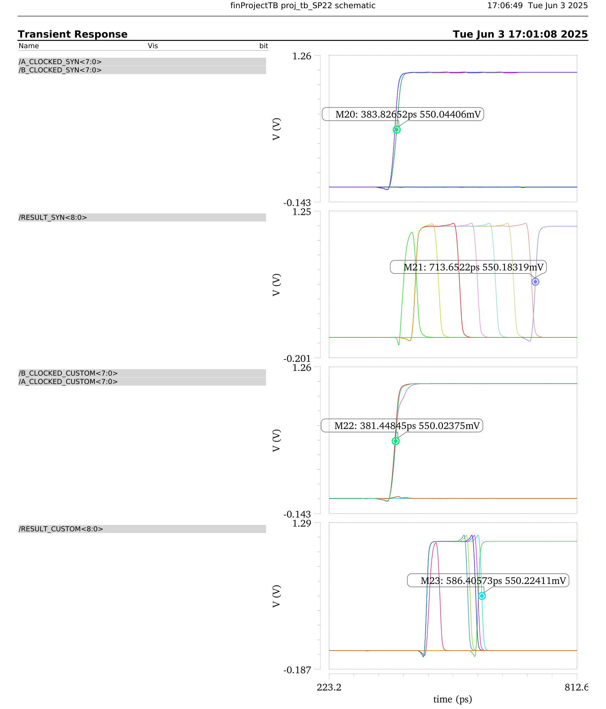

# 8-bit Kogge-Stone Adder (CMOS Implementation)
A high-speed, 8-bit Kogge-Stone Adder (KSA) implemented using static CMOS logic in Cadence, designed for minimum delay, reduced transistor count, and robust signal integrity at the transistor level.

## Overview
This project implements an 8-bit parallel-prefix adder using the Kogge-Stone architecture. The goal was to reduce critical path delay and ensure timing robustness in a custom CMOS environment.

### Key Objectives:
- High-speed 8-bit adder design using static CMOS
- Transistor-level schematic implementation and optimization
- Full functionality verified through simulation in Cadence

## Functionalities & Implementation
### Chosen Architecture
- **Kogge-Stone Adder (KSA)**
  - Computes propagate (P) and generate (G) signals in parallel
  - Logarithmic carry computation delay
  - Fully parallelizable prefix tree for carry generation

### Functional Components
- **Propagate-Generate (PG) Cell**
  - XOR logic for propagate
  - AND logic for generate

- **Black Cell Variants**
  - _Standard Black Cell_: Computes ```Gi:j = Gi + Pi ⋅ Gj``` and ```Pi:j = Pi ⋅ Pj```
  - _Non-Inverting Input Black Cell_: Produces inverted outputs
  - _Inverting Input Black Cell_: Produces non-inverted outputs

- **Grey Cell**
  - Computes group generate only for efficient edge cases

- **Sum Logic**
  - Computes ```Sum[i] = Pi ⊕ Ci```

### Functional Components
- Piecewise Linear (PWL) sources used to simulate real-world signal transitions
- Dynamic testbenches with DFFs to analyze behavior under glitchy inputs

## Innovative Features
- **AOI21-based Generate Logic:** Faster group generate with lower transistor count
- **Transmission Gate XORs:** Efficient P and Sum computation
- **Inverter-Free Prefix Optimization:**
  - Alternating black cell variants to eliminate unnecessary inverters
- **Buffering Strategy:**
  - Buffers placed before/after sum logic to ensure signal strength and reduce glitches
- **Testbench Design:**
  - Designed to detect worst-case delay paths using carefully chosen input transitions

## Figures
1. **Standard Black Cell**

_Computes ```Gi:j = Gi + PiGj and Pi:j = PiPj``` using AOI21 and XOR logic._


2. **Black Cell Variant A (Non-Inverting Inputs, Inverting Outputs)**

_Used at early tree stages to reduce need for output inverters._



3. **Black Cell Variant B (Inverting Inputs, Non-Inverting Outputs)**

_Allows alternating stages to cancel inversions._



4. **Propagate-Generate Cell**

_Produces initial P and G signals from input bits A and B._


5. **Complete 8-bit Kogge-Stone Adder**

_Full adder assembled using all cell types._


6. **Testbench Waveforms**

  - (a) Ripple-Carry Adder waveform at 3.4 GHz


  - (b) 8-bit KSA waveform at 3.4 GHz


7. **Propagation Delay Graph**

_Shows delay vs. input transition pairs._



8. **Performance Summary Table**

Compares KSA vs RCA in terms of delay, energy, maximum clocking frequency, etc.


## Additional Assets
- **Dynamic Testbench Schematic**

_Includes DFFs and PWL inputs to capture glitch resilience._


- Gate-Level RTL Schematic

_Captured layout view of the synthesized adder._


## Future Improvements
- Explore dynamic logic styles to further minimize propagation delay.
- Integrate flip-flop pipelining for glitch resistance and high-frequency operation.
- Continue transistor sizing optimization for better power-delay tradeoffs.

## References
- Ramasamy, Senthil G. “Design and Analysis of Kogge-Stone and Han-Carlson Adders in 130nm CMOS Technology”. _International Journal of Research_, Vol. 05(07), 2018. [Link to Paper](https://www.researchgate.net/publication/344955631_Design_and_Analysis_of_Kogge-Stone_and_Han-Carlson_Adders_in_130nm_CMOS_Technology)

© 2025 Nick Ji

For educational and demonstration purposes.
